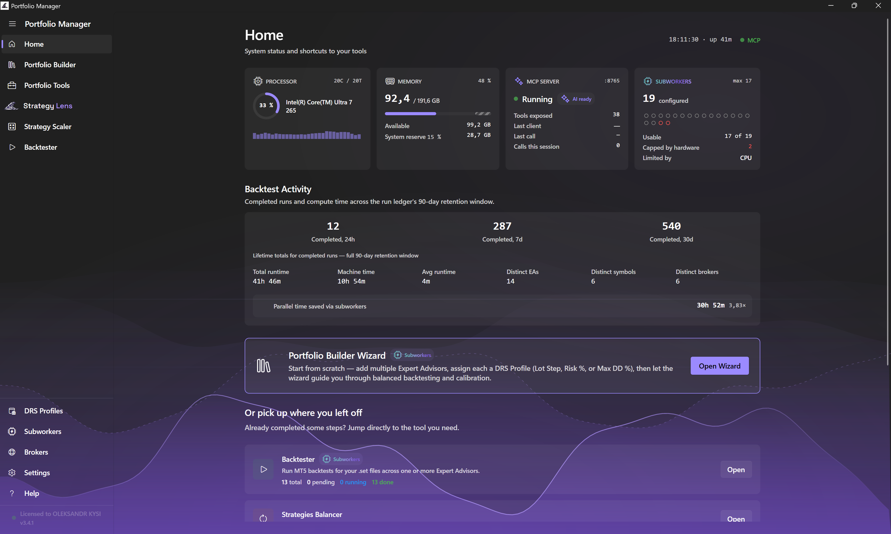
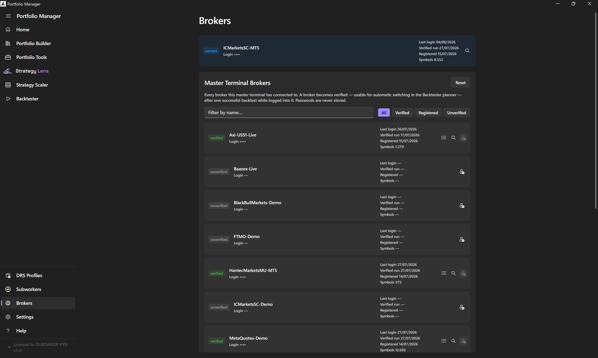
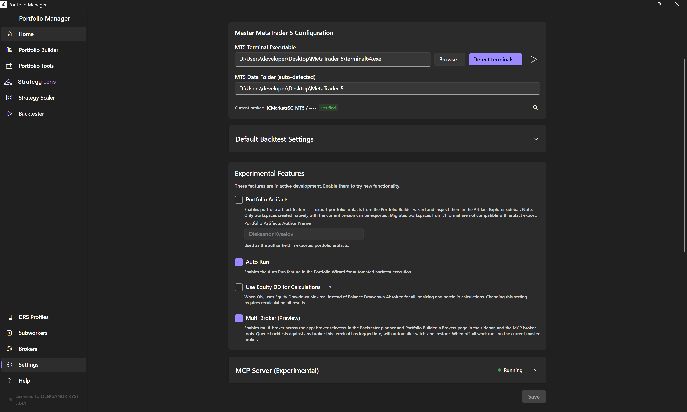
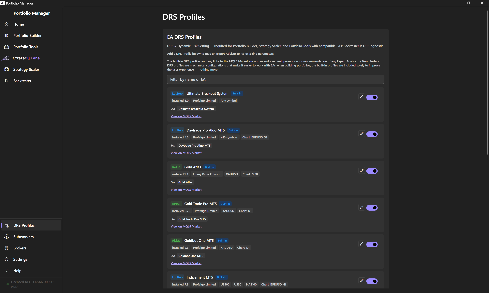

# TrendSurfers Portfolio Manager

> A professional desktop application for MetaTrader 5 traders — build, calibrate, and deploy risk-optimized multi-strategy portfolios. **Now with multi-broker backtesting, a guided MT5 setup, and a one-click AI setup that runs your backtests *and* reads the results (3.4.1 preview).**

**Website:** [trendsurfers.io](https://trendsurfers.io/)

**📖 New here?** Start with the **[Quick-Start Guide (PDF)](docs/Portfolio-Manager-Quick-Start-Guide.pdf)** — a beginner-friendly walkthrough from install to your first balanced portfolio.

---

## What Is It?

**TrendSurfers Portfolio Manager** is a Windows desktop app designed for systematic MT5 traders who run multiple strategies together. Instead of managing each strategy in isolation, the app helps you combine them into a single balanced portfolio — with equalized drawdowns, correct lot sizing, and calibration to your exact risk tolerance.

The result: a set of ready-to-deploy `.set` files where every strategy contributes equally to the portfolio's risk, and the total drawdown stays within your defined target.

---

## Screenshots

<p align="center">
  
  <br/><em>Home — guided MetaTrader 5 setup, live workers, and one-glance access to every tool</em>
</p>

<p align="center">
  
  <br/><em>Multi-broker — register and switch brokers from inside the app, then backtest across them</em>
</p>

<p align="center">
  
  <br/><em>Settings — copy one MCP configuration and your AI assistant gains both hands (run backtests) and eyes (read results in StrategyLens)</em>
</p>

<p align="center">
  
  <br/><em>Dynamic Risk Settings profiles — define risk once, reuse it across every strategy</em>
</p>

<p align="center">
  
  <br/><em>Workers panel — live status, smart resource sizing, and per-strategy elapsed timers</em>
</p>

<p align="center">
  
  <br/><em>Backtester — batch backtest queue with MT5 auto-discovery</em>
</p>

<p align="center">
  
  <br/><em>Portfolio Wizard — Calibration step: compute LotSizeStep for any account size</em>
</p>

<p align="center">
  
  <br/><em>Portfolio Wizard — Statistics: portfolio-level Sharpe, profit factor, and correlation matrix</em>
</p>

---

## Core Features

### 🚀 MT5 Subworkers — Parallel Backtesting (NEW in v3.0.0)
- Spawn multiple isolated subworker copies of your master MT5 terminal to run backtests in parallel.
- Smart resource sizing: subworker count auto-scales to your CPU, RAM, and disk capacity.
- Reserved RAM percentage slider keeps the host system responsive while runs are in flight.
- Master-first warm-up: identical date-range / symbol / tick-model combinations are computed once and reused — no repeat work.
- Live Workers pill in both the Portfolio Builder wizard and Backtester Queue, with per-strategy elapsed timers and per-row Retry on failure.

### 🧙 Portfolio Builder Wizard
A guided 5-step process from raw strategies to a deployable portfolio:

| Step | What It Does |
|------|-------------|
| **Setup** | Import strategy `.set` files, select symbol, configure backtest parameters |
| **Backtest All** | Run each strategy at a uniform base lot to measure individual drawdown |
| **Strategies Balancer** | Scale lots to equalize max drawdown across all strategies |
| **Calibration** | Compute `LotSizeStep` for each strategy to hit a target DD% on any account size |
| **Validation** | Run confirmation backtests to verify calibration is correct |
| **Export** | Package calibrated `.set` files and all backtest reports |

### 📊 Portfolio Calculator
- Load MT5 HTML backtest reports or `.set` files
- Compute Pearson correlation matrix between strategies
- Calculate balanced lots for a custom target drawdown
- View portfolio-level Sharpe ratio, profit factor, and return/DD ratio

### ⚡ Strategy Scaler
Quick lot-sizing tool — drag in an HTML report or `.set` file and get a scaled lot multiplier instantly.

### 🔁 Backtester
Batch backtest queue with:
- Auto-discovery of MT5 EAs and available symbols
- Multiple date ranges per strategy
- Persistent queue state (survives app restarts)
- Cooldown management to keep MT5 stable
- Parallel execution via MT5 Subworkers (see above)

---

## MetaTrader 5 Integration

- **Auto-discovery**: Scans MT5 data folder for installed EAs and available symbols
- **HTML Report Parsing**: Reads MT5 backtest reports to extract all key metrics
- **`.set` File Management**: Reads and writes MT5 strategy parameters:
  - `StartLots` / `FixedLots` — lot sizes
  - `LotPerBalance_step` — balance-based scaling for live accounts
  - `Risk` — switches between fixed and balance-proportional modes

---

## How Calibration Works

**Lot Balancing** — equalize drawdown across strategies:
```
BalancedLot = BaseLot × (TargetDD / StrategyDD)
```

**Calibration** — scale for any account size at a target DD%:
```
BaseValue = PortfolioDD / (TargetDD% / 100)
LotSizeStep = floor(BaseValue × 0.01 / BalancedLot)
```

At runtime, the EA scales automatically:
```
Lots = floor(AccountBalance / LotSizeStep) × 0.01
```

---

## Key Metrics

| Metric | Level |
|--------|-------|
| Max Drawdown | Strategy + Portfolio |
| Net Profit | Strategy + Portfolio |
| Profit Factor | Strategy + Portfolio |
| Sharpe Ratio | Strategy + Portfolio |
| Correlation Matrix | All strategy pairs |
| Win Rate, Trade Count | Per strategy |
| Min Required Balance | Portfolio |

---

## System Requirements

- **OS**: Windows 10 or later (64-bit)
- **RAM**: 4 GB minimum, 8 GB+ recommended
- **MetaTrader 5**: Installed with tick data for your trading symbols
- **Internet**: Required for license verification and automatic updates
- **.NET Runtime**: Bundled — no separate installation needed

---

## Installation

1. Download the latest `TS.PortfolioManager-win-Setup.exe` from [Releases](../../releases)
2. Run the installer — no admin rights required
3. The app auto-updates in the background on future launches

> ℹ️ Existing installations will be notified of the v3.0.0 upgrade through the new in-app Update Banner.

---

## ⚠️ Known Issues — v3.4.1 Preview 9

**This build is digitally signed**, issued through Microsoft's own code-signing service — Windows recognizes Portfolio Manager as coming from a verified publisher instead of showing an unknown-publisher warning.

**A few antivirus tools may still flag it — this is expected, not a real detection.** A newly signed publisher doesn't have an established reputation yet, so in the period right after signing starts, some antivirus tools may report a false positive (trojan, malware, or ransomware) on the installer. A few users have already reported this. It should clear up on its own as the signed publisher builds a track record. If your antivirus flags the installer, it's safe to allow it.

**Tick preparation for backtests has been rebuilt, and a few gaps remain while that work continues:**
- Preparing tick data ahead of a backtest is currently based on the single Symbol chosen in the Backtesting Planner or Portfolio Builder. A strategy that trades more than one symbol internally, or the Ultimate Breakout System run through its AutoLoader, doesn't get its data prepared this way yet. The same gap shows up whenever your account currency differs from the symbol's own currency — trading Gold (priced in USD) on a Euro-denominated account, for example, also needs price history for the EUR/USD conversion pair, and that isn't prepared ahead of time either. Those runs still work, just without that speed benefit.
- Only the master terminal's minute-bar history is prepared ahead of time today; each MT5 Subworker running in parallel still downloads its own minute-bar history independently.
- A queued batch prepares every symbol in it before any backtest in that batch starts, even if one strategy's data was ready sooner. We're actively working on preparing symbols in parallel when Subworkers are available, and on always preparing whichever symbol next unlocks the most strategies when they aren't — so backtests start running sooner either way.

We're aware of all of the above and actively working through them.

---

## Contact & Community

| Channel | Link |
|---------|------|
| Website | [trendsurfers.io](https://trendsurfers.io/) |
| Discord | [discord.gg/3HnQDZ5hT5](https://discord.gg/3HnQDZ5hT5) |
| Telegram | [Community group](https://t.me/+GyaH3OhxW802N2I0) |
| General / Support | [hello@trendsurfers.io](mailto:hello@trendsurfers.io) |
| Legal | [legal@trendsurfers.io](mailto:legal@trendsurfers.io) |

---

## License

This software is proprietary. Licenses are available for purchase with a 30-day money-back guarantee. Visit [trendsurfers.io](https://trendsurfers.io/) for pricing and licensing details.

**By downloading, installing, or using this software you agree to the [End User License Agreement](https://trendsurfers.io/eula/).** If you do not accept the EULA, do not install or use the software.

| Legal document | Link |
|---------------|------|
| End User License Agreement (EULA) | [trendsurfers.io/eula/](https://trendsurfers.io/eula/) |
| Privacy Policy | [trendsurfers.io/privacy/](https://trendsurfers.io/privacy/) |
| Cookie Policy | [trendsurfers.io/cookies/](https://trendsurfers.io/cookies/) |
| Legal Notice (Aviso Legal) | [trendsurfers.io/legal/](https://trendsurfers.io/legal/) |
| Trademark Notices | [trendsurfers.io/legal/#trademarks](https://trendsurfers.io/legal/#trademarks) |

---

## Legal Notices

### Trademark Disclaimers

**TrendSurfers Portfolio Manager** is an independent product developed by **INFINITYDEV, S.L.** (NIF B-44974798, Plaça Jardí Enric Morera 2, Bajos, 17600 Figueres, Girona, Spain).

INFINITYDEV, S.L. is **not** affiliated with, endorsed by, sponsored by, certified by, or otherwise connected to MetaQuotes Software Corp., MetaQuotes Ltd., or any of their affiliated entities. This product is not approved by MetaQuotes, and MetaQuotes provides no warranty, support, or representation regarding it.

"MetaTrader", "MetaTrader 4", "MetaTrader 5", "MT4", "MT5", "MQL4", and "MQL5" are registered trademarks of MetaQuotes Software Corp. and/or its affiliated entities. All other product names, trademarks, service marks, and registered trademarks referenced in this software or its accompanying materials are the property of their respective owners and are used solely for identification and descriptive purposes. Such use does not imply endorsement, sponsorship, or any affiliation between INFINITYDEV, S.L. and the trademark holders.

### Trading Risk Disclaimer

**This software is a research and portfolio-construction tool. It is not a trading signal service, a robo-advisor, an automated execution engine, an investment recommendation system, or a financial-advice product.** It does not place trades, does not connect to live broker accounts to execute orders, and does not represent that any output will be profitable or suitable for live deployment.

All outputs — including backtest results, calibration parameters, lot-sizing values, set files, portfolio artifacts, drawdown estimates, and risk metrics — are **research outputs** intended for the user's own evaluation. They are not trading recommendations, signals, advice, instructions, or directions to act.

**Past performance, backtest performance, and simulated performance are not indicative of future results.** All decisions to deploy, modify, or trade any portfolio derived from the software's outputs are made solely by the user, at the user's risk, and with the user's full responsibility for any resulting financial outcome.

Nothing in this software, including any documentation, marketing materials, or in-app text, constitutes investment advice, financial advice, tax advice, or legal advice. Consult qualified professional advisors before making any financial decisions.

### Platform Dependency Notice

This software is designed to interoperate with MetaTrader 5 and depends on specific MT5 capabilities for its operation (including CLI backtest invocation, terminal automation, set-file formats, and strategy-tester output). MetaQuotes Software Corp. is an independent third party over which INFINITYDEV, S.L. has no control. MetaQuotes may, at any time, modify, restrict, deprecate, or remove any MT5 capability. Such changes may cause parts or all of this software to stop functioning. This does not constitute a defect in the software, and INFINITYDEV, S.L. assumes no responsibility for changes made by MetaQuotes or any other third-party platform.

&copy; 2024–2026 INFINITYDEV, S.L. All rights reserved.
